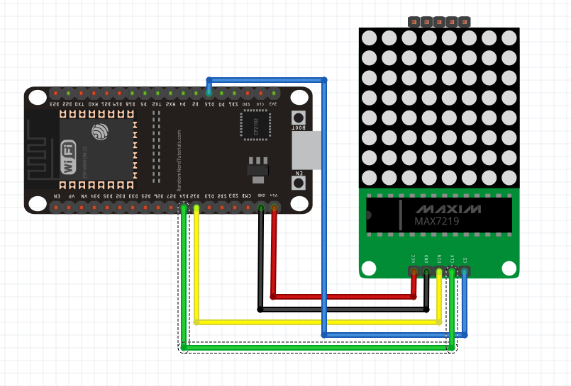

# RUNNING_TEXT
Contoh running menggunakan eps32 LED dot matrix

## Peralatan yang dibutuhkan adalah
1. Eps32
2. LED dot matrix 
3. [Library](https://github.com/gdampf/esp32-led-matrix)

## Schematic
<figure style="text-align: center">
                  
              </figure>
